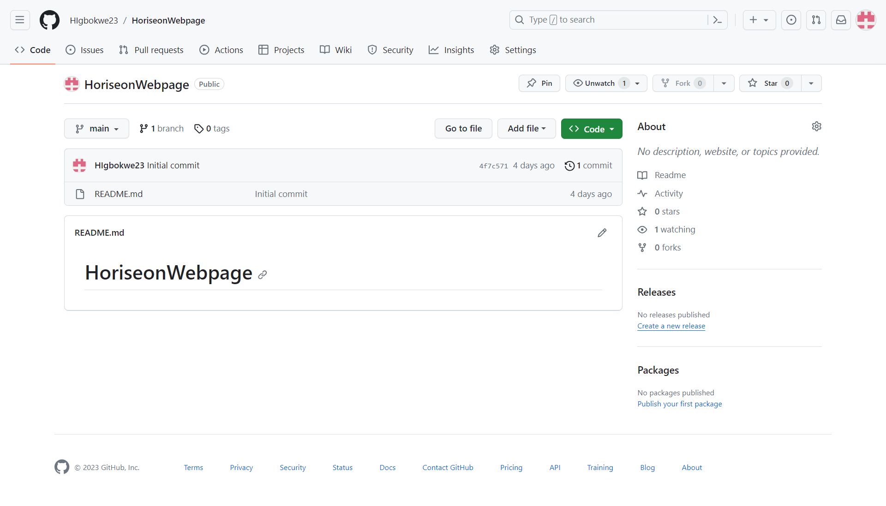

# HoriseonWebpage
# <HoriseonWedpage>

## Description

I am working for a marketing agency and have been given the task of improving the accessesibilty of their website - Horiseon. Making the website more accessible will help users with disabilities to navigate the site and also improve the ranking in search engines like Google. I have learned the importance of using semantic HTML tags such as <header>, <footer>, <section> etc as they improve SEO and give structure to webpages. 

## Installation

Deployed on GitHub Pages

[This is the link to my webpage](https://higbokwe23.github.io/HoriseonWebpage/)

[This is the link to my git hub repo](https://github.com/HIgbokwe23/HoriseonWebpage)

## Usage

Provide instructions and examples for use. Include screenshots as needed.

To add a screenshot, create an `assets/images` folder in your repository and upload your screenshot to it. Then, using the relative file path, add it to your README using the following syntax:

## Credits

https://www.youtube.com/watch?v=qfpo_XsM0hM&list=PL4cUxeGkcC9gQeDH6xYhmO-db2mhoTSrT&index=7

## License

MIT
---

https://higbokwe23.github.io/HoriseonWebpage/

https://github.com/HIgbokwe23/HoriseonWebpage